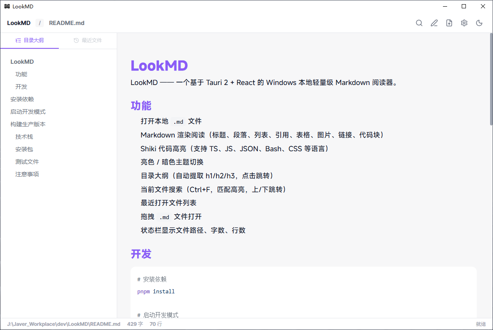
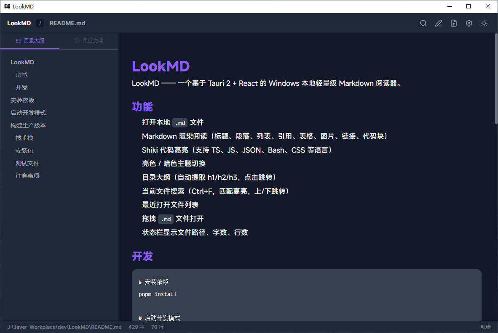
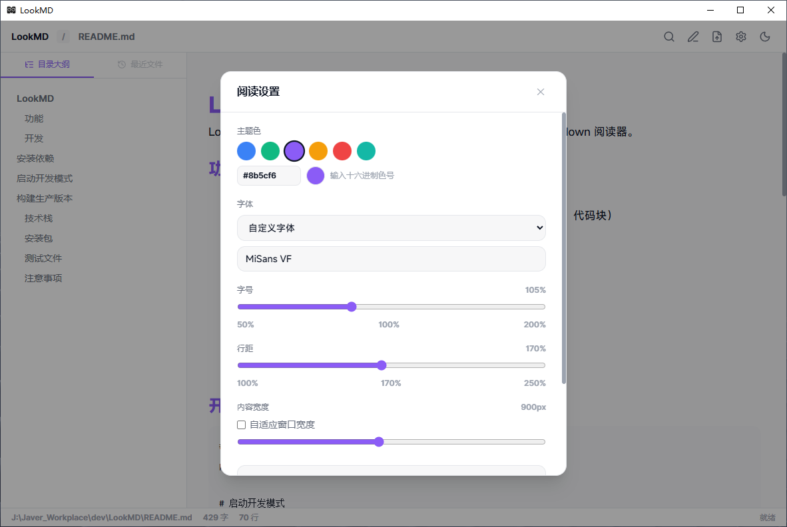
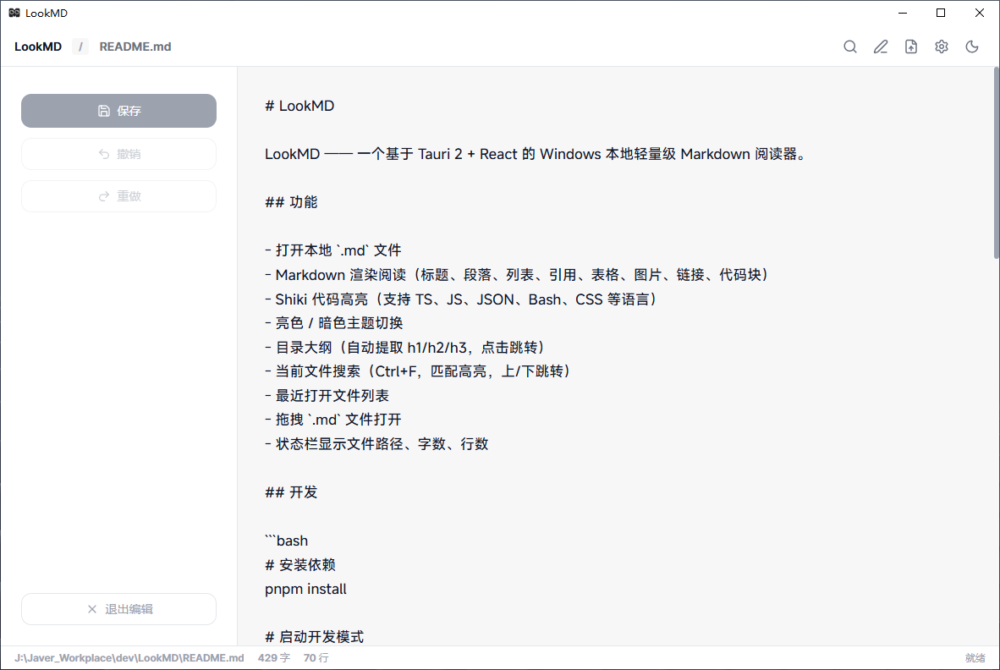

<p align="center">
  
</p>

<h1 align="center">LookMD</h1>

<p align="center">
  <strong>Windows 本地轻量级 Markdown 阅读器</strong>
</p>

<p align="center">
  基于 Tauri 2 + React 19 + TypeScript，开箱即用的桌面 Markdown 阅读工具。
</p>

## 截图

| 默认界面 (亮色) | 暗色模式 | 设置面板 | 文件编辑与浏览 |
|:---:|:---:|:---:|:---:|
|  |  |  |  |

## 功能

- 打开本地 `.md` 文件
- Markdown 渲染阅读（标题、段落、列表、引用、表格、图片、链接、代码块）
- Shiki 代码高亮（支持 TS、JS、JSON、Bash、CSS 等语言）
- 亮色 / 暗色主题切换
- 目录大纲（自动提取 h1/h2/h3，点击跳转）
- 当前文件搜索（Ctrl+F，匹配高亮，上/下跳转）
- 最近打开文件列表
- 拖拽 `.md` 文件打开
- 状态栏显示文件路径、字数、行数

## 开发

```bash
# 安装依赖
pnpm install

# 启动开发模式
pnpm tauri dev

# 构建生产版本
pnpm tauri build
```

## 技术栈

| 技术 | 用途 |
|------|------|
| Tauri 2 | 桌面应用框架 |
| React 19 | 前端框架 |
| TypeScript | 类型系统 |
| Vite 8 | 构建工具 |
| TailwindCSS v4 | 样式框架 |
| markdown-it | Markdown 解析 |
| markdown-it-anchor | 标题锚点 |
| Shiki | 代码高亮 |
| DOMPurify | HTML 安全清洗 |
| lucide-react | 图标库 |

## 安装包

构建产物位于：

```
src-tauri/target/release/bundle/
├─ msi/LookMD_x.x.x_x64_en-US.msi
└─ nsis/LookMD_x.x.x_x64-setup.exe
```

## 测试文件

项目包含测试文件目录 `test-files/`，包含：

- `basic.md` - 基础 Markdown 语法
- `table.md` - 表格测试
- `code.md` - 代码高亮测试
- `image.md` - 图片测试
- `long.md` - 长文档性能测试
- `unsafe-html.md` - HTML 安全测试

## 注意事项

- 所有文件读取通过用户选择或拖拽触发，不会自动扫描文件系统
- Markdown 中的 HTML 内容经过 DOMPurify 清洗，不会执行危险脚本
